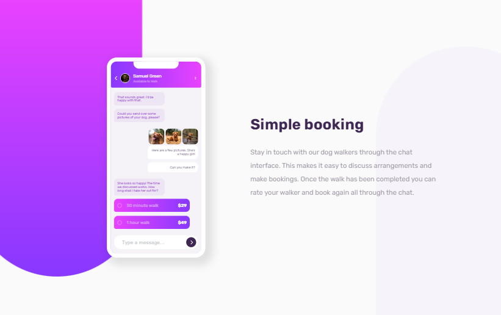

# Frontend Mentor - Chat app CSS illustration solution

This is a solution to the [Chat app CSS illustration challenge on Frontend Mentor](https://www.frontendmentor.io/challenges/chat-app-css-illustration-O5auMkFqY).

## Table of contents

- [Overview](#overview)
  - [The challenge](#the-challenge)
  - [Links](#links)
  - [Built with](#built-with)
- [Author](#author)

## Overview

### The challenge

Users should be able to:

- View the optimal layout for the component depending on their device's screen size
- See the chat interface animate on the initial load

### Screenshot

### Links

- Solution URL: [My Solution on Frontend Mentor](https://www.frontendmentor.io/solutions/chat-app-css-illustration-xdSOUVed8G)
- Live Site URL: [Live Demo](https://kiyomidev.github.io/chat-app-css-illustration/)

### Built with

- Semantic HTML5 markup
- CSS custom properties
- Flexbox
- CSS animations

## Author

- Frontend Mentor - [@KiyomiDev](https://www.frontendmentor.io/profile/kiyomidev)
- Facebook - [@KiyomiDev0](https://www.facebook.com/KiyomiDev0)